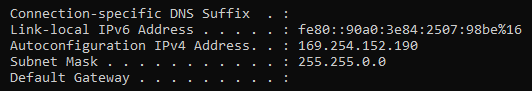

# LINUX Week 03

## PuTTy to connect Linux centos  
Winscp connect to Linux centos(in virtual box) 
 
A clear (clear screen) 
A getenforce 
 
A systemctl                  
* Start  
* Stop 
* Restart 
* Reload 
* Status 
* Disable 
* Enable 
 
 
Service—> httpd, sshd, firewalld  
 d for daemon 
 
A su (change to super user) 
A gedit /etc/selinux/config 
 
A reboot 

* redhat  
* fedora 
* centos  

This 3 Linux system using the same Command (yum) 

* A yum install httpd  
* A systemctl start httpd 
* A systemctl status httpd 
Use ip at web(org com) to check is it successful （Web Server） 
 
Linux structure:  

Ubuntu use apt 
 
A ls  
A mv hi.htm /var/www/html 
 
A echo “hi” > hi.htm ( put hi into hi.htm file) 
A cat hi.htm( show the content of file hi.htm) 

Ipv6 is address 
 
A ping -6 ipv6address 
 
Ipv6 on windows 
A echo “hi” > hi.htm 
A more hi.htm 
A python -m http.server 8888(port number) 
 
Go web 
http://[ipv6address]:8888(port number)/hi.htm(file name) 
 
 
IPv6 on Linux 
A echo “hi” > hi.htm 
A python -m server 
 
To check website working? 
A curl http://ipv4address:6666(portnumber) 
(If get something mean working else is NOT, using ipv4) 
 
Dynv6.com (change IPv6 to domain lane) 
dmallko.dynv6.net:9999(portnumber)/hi.htm 