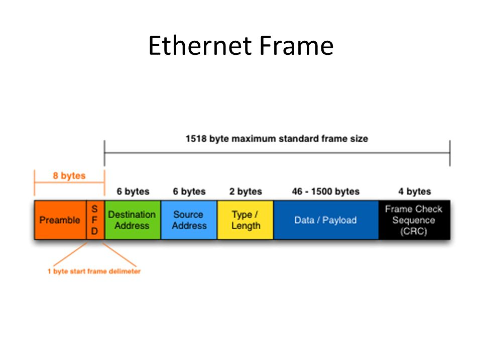

# LINUX Week 05

## A ifconfig 
### 介面卡名稱 

* enp0s3(for internet use,ip start with 10.0.2 
* enp0s8(for connect with host) 
* lo (loop back) 

### ether  

* 代表網絡卡卡號(Mac address) 

### mtu 
 

#### A ifconfig enp0s3 
A ifconfig enp0s3 | grep netmask
* | output of before this symbol became input of after symbol ,grep is like filter 

A ifconfig enp0s3 | grep netmask | awk '{print $2}' 
* awk '{print $2}' will show the column 2 of it

A ifconfig enp0s3 0 
* Clear the ip setting, will clear default route also  
* Need to enter super user 

A ifconfig enp0s3 10.0.2.15 netmask 255.255.255.0 broadcast 10.0.2.255 
* To set back the ip address 

#### To check router 
A route -n (route print, in windows) 
* Default route both 0.0.0.0  

A ping -c 1 8.8.8.8  
* Ping 1 time to default route 

A ip route add default via 10.0.2.2 
* To add default route with 10.0.2.2 ipv4. 

A ifconfig enp0s3 hw ether 00:00:00:00:00:01 
* To change mac address, temporally  

A ifconfig | grep inet | grep -v inet6 | awk '{print $2}' 
* -v inet6 , mean throw whatever matched inet6.(throw the matched) 

To power off computer  
A poweroff   
A shutdown -h now   
A halt -p 

To restart   
A reboot  
A shutdown -r now 

Different file system
 
* FAT32(one file can't store more than 4GB),(SD card) 
* NTFS(windows disk) 
* efat(extension of FAT32, SD card,usb) 
    * Different file system support different one file storage and files store. 

In linux: 

* At least 2 partition for disk, P+P , P+L , etc… 
* root(根目錄) and swap 
    * Swap is use Hard disk to simulate memory when its needed.(Is slower than real memory) 
    * Root contain all folders/files(virtual partition), like /home, /etc, /boot, /var, /mnt, /tmp, /sys, /proc, /dev…. 
    * A/-->partition 
    * Use VFS(virtual file system), can support different file system, it will hidden the original directory for new file system(ex: usb inserted). For exmaple: a.file in boot directory, b.file in usb. When we mount the usb into boot directory, we can see b.file and not a.file, but after we unmount the usb from boot directory, then we now can see a.file . 
* /var for saving variable

A hostnamectl set-hostname newhostname  
A bash 
* Restart shell 

A hostname 
* To check hostname 
Success 

A pwd 
* Print working directory 

Money work: 
* First, get ip address. 

 