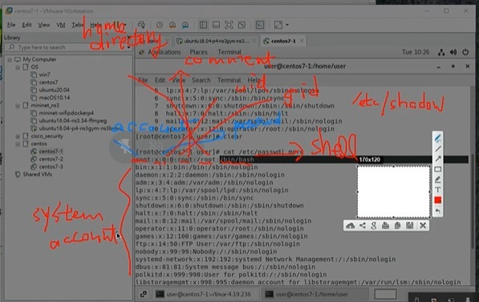
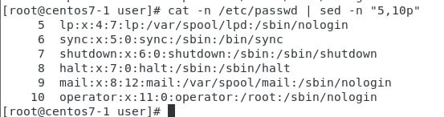
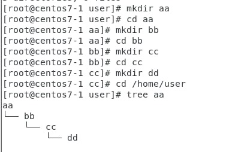
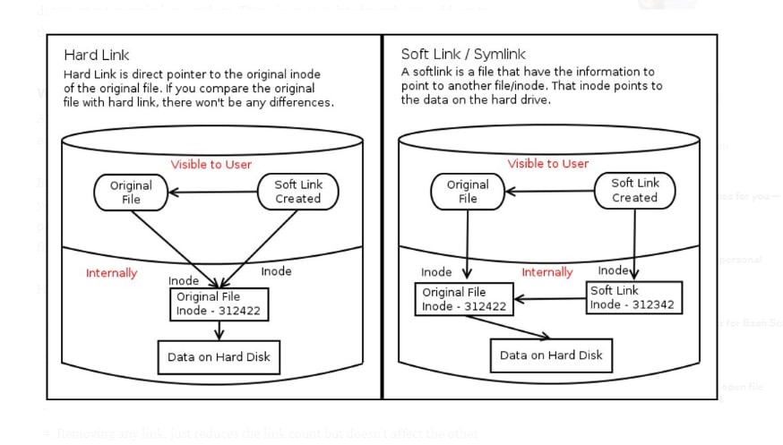
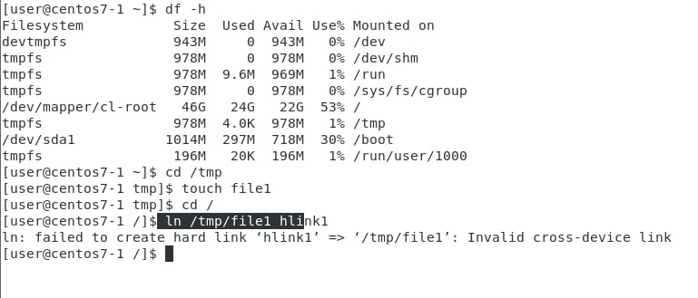
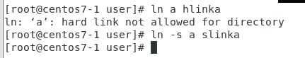

# LINUX Week 09

Different of "su" and "su -" </br>
A echo $PATH </br>
A su </br>
A echo $PATH </br>
Environmental variable is the same 

A su - </br>
A echo $PATH </br>
Environmental variable will be different, will be root environmental variable 

To check kernel version </br>
A uname -r 

## Compile kernel version on CentOS 
https://www.ltsplus.com/linux/rhel-centos-7-compile-kernel </br>
Go to kernel.org, copy link of the "tarball"(check your gcc version for convenient) 

A cd /tmp </br>
A wget "https://cdn.kernel.org/pub/linux/kernel/v4.x/linux-4.19.237.tar.xz" 

Will start download,("wget" can download without open the page) 

A rm -rf linux-4.19.237 </br>
A rm -rf linux-4.19.237.tar.xz 

A make menuconfig </br>
A make bzImage 
* Wait 
* A echo $? 
    * The previous command executed successfully? 
    * "0" means successfully 
    * Not "0" means failed 
A make modules 
* Wait 

A make -j8 
* Wait 

A make modules_install 
* Wait 

A make install </br>
A reboot </br>
A uname -r 

And you will see the new kernel </br>
END 

A sudo -l 
* To check whether the user can switch to super user 

A cat /etc/passwd| more 


A cat /etc/passwd | head -n 5 
* Show the first 5 line 

A cat /etc/passwd | tail -n 5 
* Show the last 5 line 

A cat /etc/passwd | head -n 10 | tail -n 6 
* Will  
* show from 5~10 lines 

OR 


A touch 
* Used to create a new file or change the access/modify/change time 

A echo 
* A echo "1" > a.txt 
    * Replace "1" in the file a.txt 
* A echo "1" > a.txt 
    * Add "1" into file a.txt 

A mkdir 
* A mkdir -p a 
    * If "a" directory exit then do nothing, if not exit then create "a" directory 
    * Can use to create a/b/c/d(mkdir -p a/b/c/d) instead of create 1 by 1 
* 1 by 1   

 

A cat 
* A cat <<aa > a.txt 
    * Use "<<aa" as a start of editing file 
    * When type "aa" then will end editing mode and input the between into the file 
    * "<<aa" , aa can be replace by any characters 
```
[root@centos7-1 user]# cat <<E0F > a.txt
> hello world 
> 1234 
> EOF 
```
```
[ root@centos7-1 user]# cat a.txt
hello world 
1234 
[ root@centos7-1 user]#
```

Shortcut 
* In Windows, refers to a directory or a file 
* In Linux, separate to hard link and symbolic link 

 

* Hard link only 1 inode(shared), but symbolic link has 2 inode 
    * If delete original file, then symbolic link will refer to NULL, but in hard link still can access to original file 
* Hard link cannot be created at different partition but symbolic link can support 

 

* Hard link cannot link to a directory but symbolic can link to a directory 



* Hard link can edit the permission, symbolic link cannot edit permission only refer to the original file/directory 