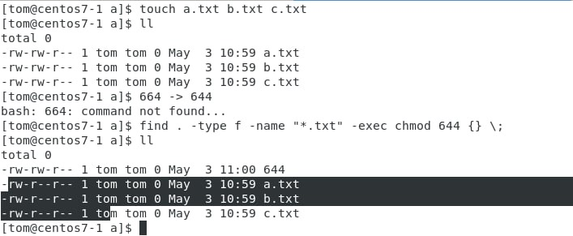
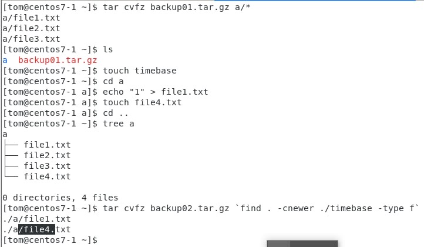
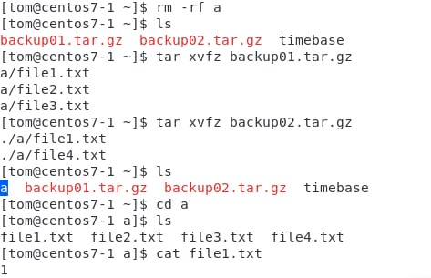

# LINUX Week 12

To check a user exit or not 
* id tom 1>/dev/null 2>&1 
* echo $? 
* Output 0 means exited, others than 0 is not exit \

To get ip of "ens33" 
*  ifconfig ens33 | grep inet | grep -v inet6 | awk '{print $2}' 
```
./getip.sh ens33
```
inside getip.sh
```
#!/usr/bin/bash

ip='ifconfig $1 | grep inet | grep -v inet6 | awk '{print $2}'`

echo "ip: $ip"
```
Get mac address  
```
./getip.sh enp0s58
```
inside getip.sh
```
ip='ifconfig $1 | grep inet | grep -v inet6 | awk '{print $2}'`
eth=`ifconfig $1 | grep ether | awk '{print $2}'`

echo "ip: $ip"
echo "mac: $eth"
```
## Practice  
```
#!/usr/bin/bash 
 ip =` ifconfig $1 | grep inet | grep -v inet6 | awk '{print $2}' ` 
 eth=`ifconfig $1 | grep ether | awk '{print $2}'` 
 echo "ip: $ip" 
 echo "mac: $eth" 
```
 
Several ways to find location of file 
* which  
    * Use to find exe file 
* whereis 
* locate (need to update the database first) 
    * updatedb 
    * Search at database 
* find 
    * Use most time, can find any kinds of file 
    * Can add limitation(filter) of finding file 
        ```
        `find /etc -name passwd` 
        `find /home -iname gtwang.txt` 
        `find / -type d/f/l` 
        `find . -type f -name "*.txt" -exec rm -f {} \;` 
        ```
    * Search at disk 
        ```
        find / -type f -name "*.txt"
        ```
    *  suid : 4 , sgid : 2 , stickybit : 1 
        ```
        ll /usr/bin/passwd
        -rwsr--. 1 root root 27856 Apr 1 2020 /usr/bin/passwd
        ```
    * The moment of executing the file with suid permission, normal user will become root user 
    

File Permission
* r:4 
* w:2 
* x:1 
* 644  (rw-r--r--) 
* 777 (rwxrwxrwx) 
* 755 (rwxr-xr-x) 
* 4755 (rwsr-xr-x) 
* 2755(rwxr-sr-x) 
* rwxrwxrwt 

Backup file 
```
`touch file{1..3}.txt //creating file 1.txt , 2.txt ,3.txt`
`tar cvfz backup01.tar.gz a/*` 
`touch timebase`
``` 
> Add change content of 1.txt and add file4.txt 
```
tar cvfz backup02.tar.gz `find . -cnewer ./timebase -type f`
```


