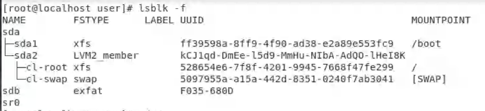
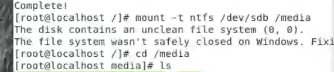
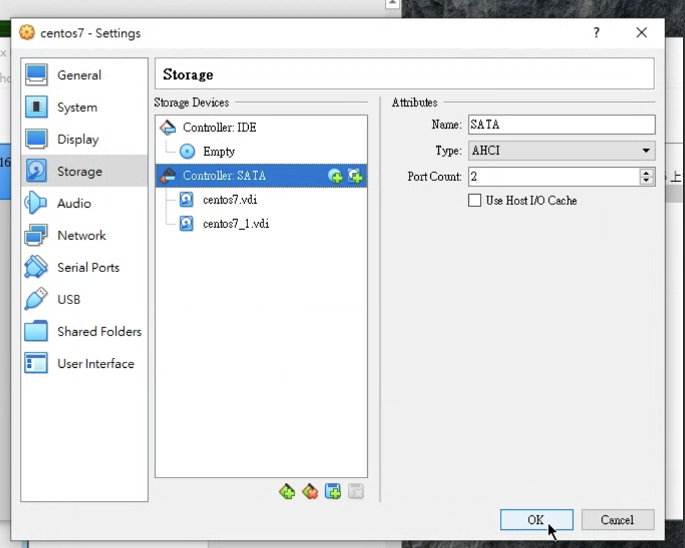
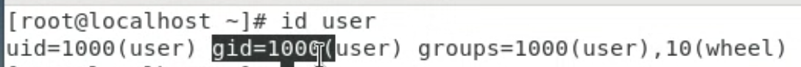
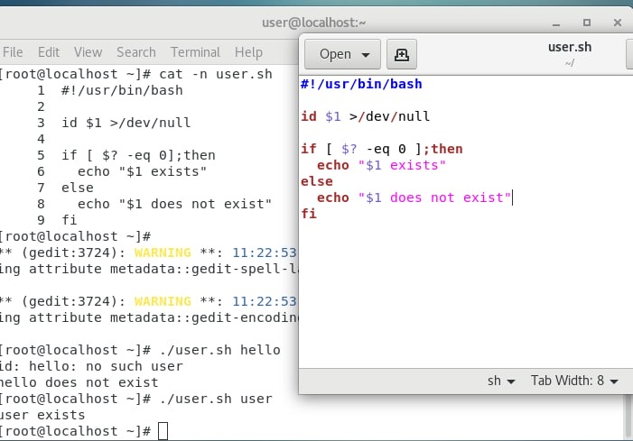
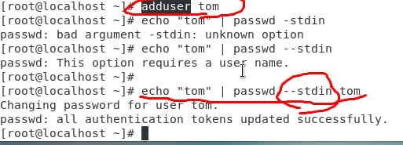
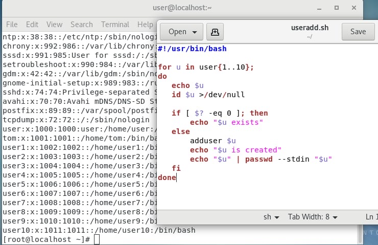
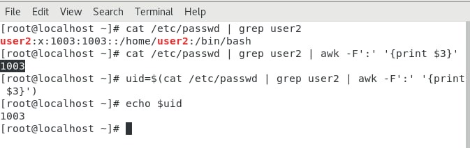

# LINUX Week 14

## Mount USB in Linux (exfat) 
* `lsblk -f` : to check the format 
* 
* https://helloworld.pixnet.net/blog/post/47458574-centos-linux-mount-exfat-格式硬碟 

## format 

* `lsblk -f` 
* `yum install epel-release -y` : to install others software 
* `yum install ntfs-3g -y` 
* * 

## Mount new storage disk in linux 

* Setting -> Storage -> SATA  
* 
* Then click the disk with + and done the step 
* Checking: 
    * `dmesg | grep sd` 
    * Need to do partition --> format --> mount before use 
    * Partition: 
    * `fdisk /dev/sdb`
    * `n` 
    * `p` 
    * `1` 
    * Enter to select default(2048) 
    * `+5G` , default is to use full storage 
    * Done 
    * `p` to check 
    * `w` to save 
    * `q` to quit 
* Format: 
    * `mkfs -t xfs /dev/sdb1` 
    * `mkfs -t xfs -f /dev/sdb2` 
* Mount: 
    * `mount -t xfs /dev/sdb1 /media` 
    * `mount -t xfs /dev/sdb2 /media`     

## Chapter 7

> gid=1000(user) is the main group, only user that join "10(wheel)" can access to super user 

> First line need to tell the shell, can use `which bash`  
`$1` mean the first parameter , `>/dev/null` cause don’t want to see the result  
`[ $? -eq 0 ]` means ($?==0) 

* Create user and password without interactive with terminal 

* Example of creating several user  

* In centos system 
    * "uid <1000" is system account 
    * "uid >= 1000" is normal user account 

