# LINUX Week 15

* find the files that have been changed 6 days ago but within14 days. Also the file size should be less than 1M. When you find those files copy them into /tmp. (One command to do the above mentioned job) 

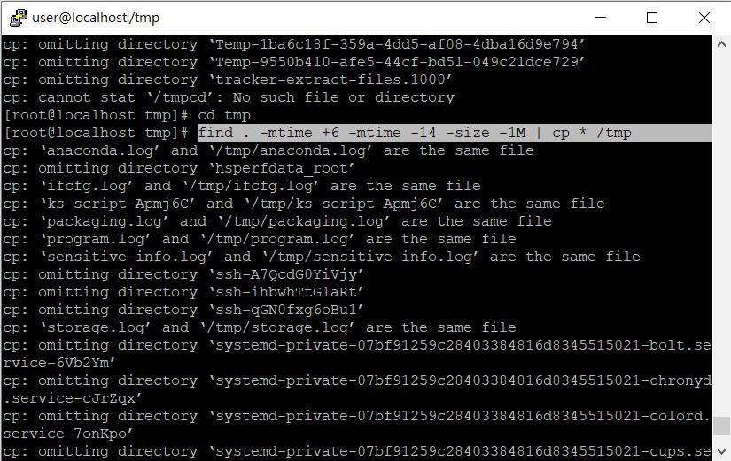

* 2. find the files 
    * under /etcthat contains "localhost". 

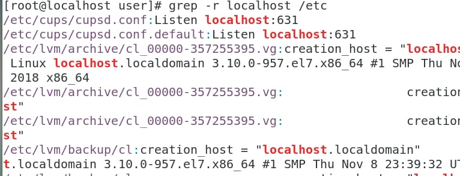

* Counting accounts    

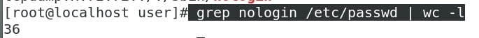

* Counting online user 

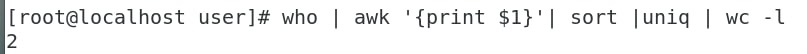

* Counting users in the system 

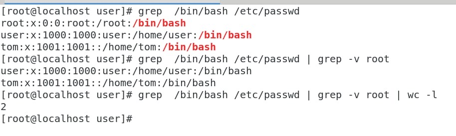

* `find` normally finding filename 
* `grep` normally grep file's ------content 

> Adding "mary" into group "rd" 

* `groupadd rd` 
* `useradd -g rd mary` 

> Adding "peter wang" 

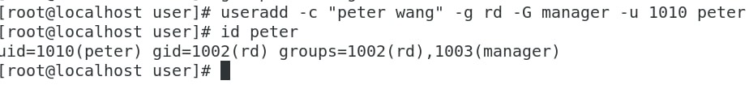

* `useradd -c "peter wang" -g rd -G manager -u 1010 peter` 
* "-c" is for annotation  
* "-u" is for uid 
* "-g" is main group 
* "-G" is

* `awk`

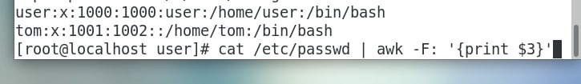

* `-F:` is the column separate by ":" 

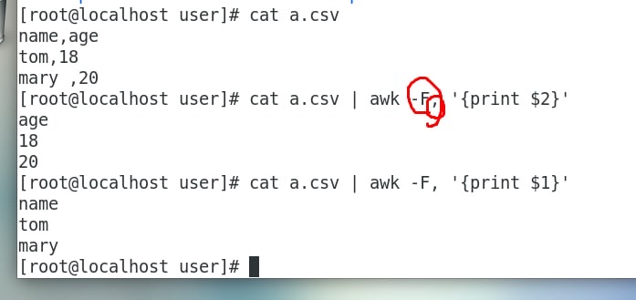

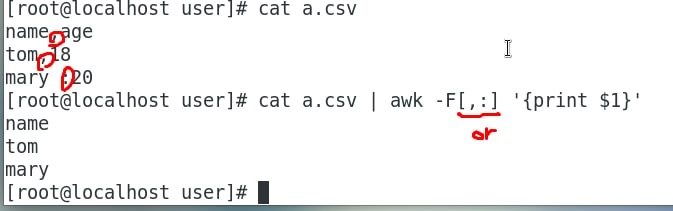

## Permission 

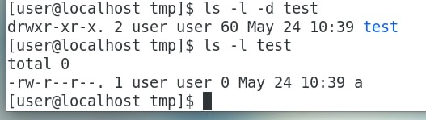

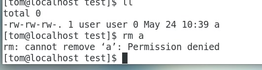

* If you want to delete the file, see if the directory has w

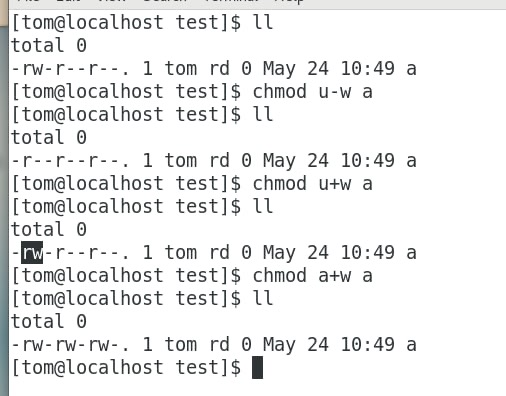
 
## Changing owner of file/directory 

* `chgown -R user.user test1` 

## Cracking password and user 

* https://kknews.cc/zh-tw/code/3vpeby3.html 
* https://snapcraft.io/install/john-the-ripper/centos 
* Installing john the ripper 

```
`sudo yum install epel -release` 
`sudo yum install snapd` 
`sudo systemctl enable --now snapd.socket` 
`sudo ln -s /var/lib/snapd/snap /snap` 
`sudo snap install john-the-ripper` 
```

//`sudo yum install *ssl -dev* 

* Combining shadow and passwd 
* Use john-the-ripper to crack password(need wordlists)  